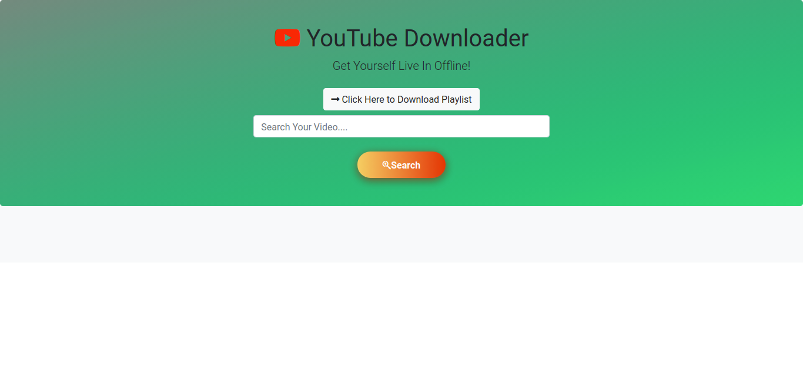
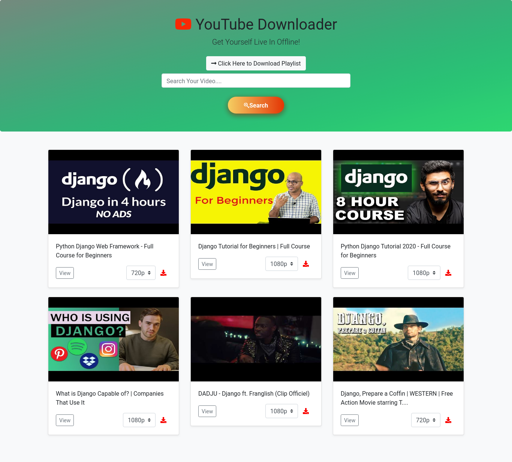

# Youtube Downloader Using Django & PyTube
___
**Home Page View**

___
**Search Page View**


**Install Require Dependecy:**
```bash
pip install django
pip install pytube3
pip install requests
```

**Create an Youtube Data API from here**
#Put the API into Project Base Setting.py file
[https://console.developers.google.com/](https://console.developers.google.com/)
